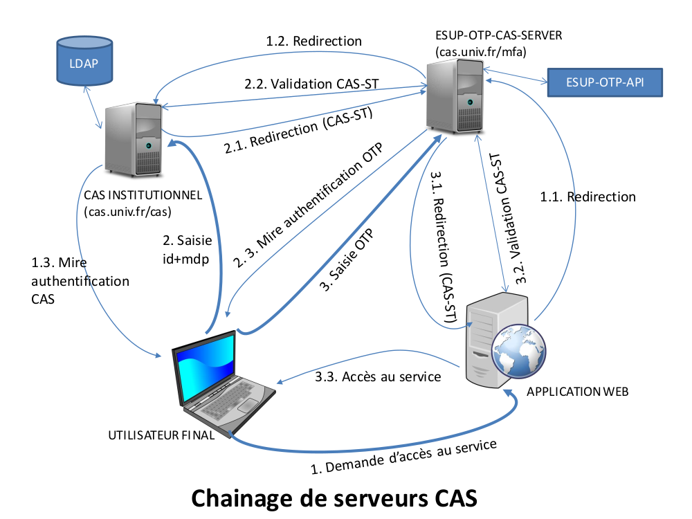

# esup-otp-cas-server

CAS server which delegates to another CAS server the password check + asks for OTP

### Features

- asks for OTP long-term validation (stored in a cookie)
- it can conditionally bypass OTP if the user has not activated any methods
- handle CAS gateway, proxy tickets CAS, CAS SLO back-channel

Features not yet implemented
- conditionally limit the allowed methods

### Requirements
- [esup-otp-api](https://github.com/EsupPortail/esup-otp-api)

### Installation
- git clone https://github.com/EsupPortail/esup-otp-cas-server
- npm install
- change the fields values in conf.js to your installation
- npm start

### Diagramme d'explication (en français)

License
----

MIT
   [EsupPortail]: <https://www.esup-portail.org/>
